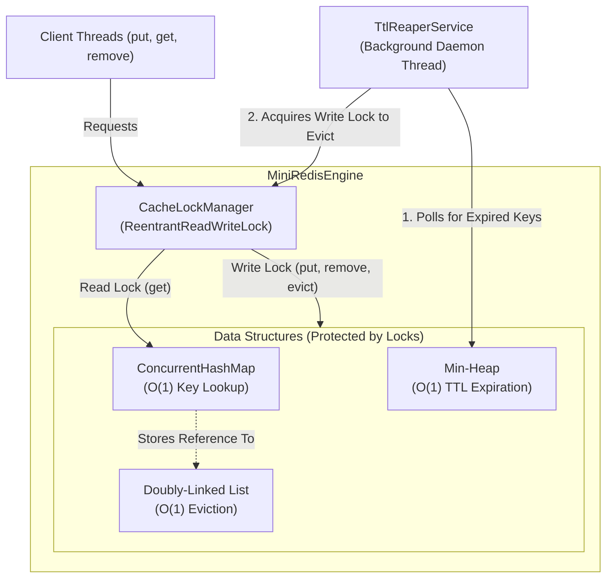

# Mini-Redis Architecture & Workflow

This document explains the internal design and data flow of the Mini-Redis Engine. It is designed to handle high-throughput concurrent access while maintaining strict $O(1)$ time complexity for all cache operations and eviction.

## System Workflow

## Component Breakdown

### 1. Concurrency & Locking (`CacheLockManager`)
Instead of locking individual segments, the engine uses a centralized `ReentrantReadWriteLock` with **fairness enabled**.
- **Read Path**: Multiple client threads can acquire the read lock simultaneously to execute `get()` operations. This ensures maximum throughput when cache hit rates are high.
- **Write Path**: Operations that mutate state (`put()`, `remove()`, or LRU reordering on a cache hit) must acquire the exclusive write lock. 

### 2. O(1) Key Lookup (`ConcurrentHashMap`)
The core storage is a standard Java `ConcurrentHashMap`. However, instead of just storing the raw value, the map stores a direct reference to a `DoublyLinkedListNode`. This allows the engine to jump directly to the node in the LRU list in $O(1)$ time without having to traverse the list.

### 3. O(1) LRU Eviction (`Doubly-Linked List`)
A custom-built intrusive doubly-linked list tracks the access order of keys. 
- When a key is accessed, the node is unlinked from its current position and moved to the head (Most Recently Used).
- When the cache reaches capacity, the node at the tail (Least Recently Used) is evicted.
- Because the `ConcurrentHashMap` gives us the exact memory reference to the node, unlinking and relinking takes exactly $O(1)$ time via pointer manipulation.

### 4. Background TTL Reaping (`Min-Heap` & `TtlReaperService`)
To prevent memory leaks from keys that are never accessed again, a background daemon thread continuously cleans up expired keys.
- **Min-Heap**: When a key is inserted with a Time-To-Live (TTL), its expiration timestamp is pushed to a Min-Heap. The root of the heap is always the key that will expire the soonest.
- **TtlReaperService**: This daemon thread sleeps until the soonest expiration time. It wakes up, peeks at the Min-Heap, and if the root key has expired, it acquires the write lock and safely evicts it from the cache.
