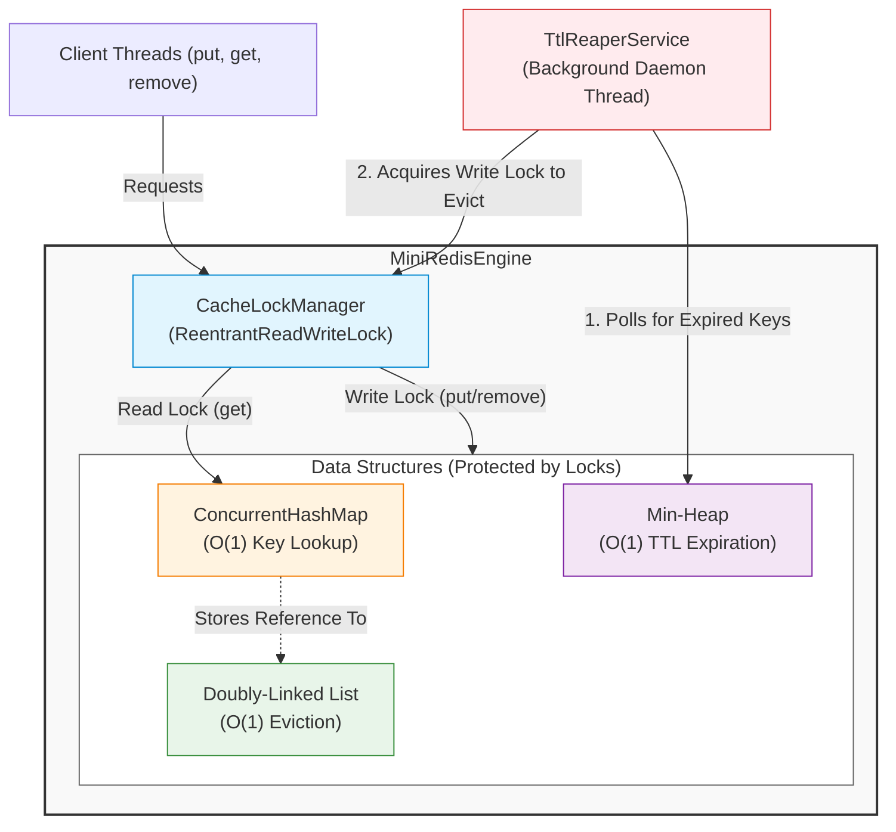

# Mini-Redis Cache Engine

A pure Java, zero-dependency in-memory caching engine. Designed for high concurrency with strict $O(1)$ LRU eviction and background TTL expiration.

## Features

- **Pure Java**: No Spring, no Maven, no external dependencies.
- **Thread-Safe**: Uses `ReentrantReadWriteLock` for high-throughput concurrent reads and safe writes.
- **O(1) LRU Eviction**: Custom doubly-linked list and `ConcurrentHashMap` guarantee constant time operations.
- **Lazy & Background TTL**: Keys expire lazily on access, and a background daemon (`TtlReaperService`) uses a Min-Heap to aggressively reap expired keys and prevent memory leaks.

## Architecture & Workflow

This flowchart illustrates how client threads and the background reaper daemon interact with the engine's core data structures through the centralized lock manager.




## Project Structure

```text
src/main/java/com/cache/miniredis/
├── concurrency/
│   └── CacheLockManager.java      # Centralized read/write lock
├── core/
│   ├── CacheManager.java          # Core interface
│   └── MiniRedisEngine.java       # Primary cache implementation
├── eviction/
│   ├── DoublyLinkedListNode.java  # Node for LRU tracking
│   ├── LRUEvictionStrategy.java   # O(1) list manipulation
│   ├── TtlHeap.java               # Min-Heap for TTL deadlines
│   └── TtlReaperService.java      # Background cleanup daemon
├── MiniRedisApplication.java      # Entry point
└── TestEngine.java                # Multi-threaded test harness
```

## Building and Testing

Because this project is built entirely without build tools like Maven or Gradle, you can compile and run the comprehensive native test suite directly via the `javac` and `java` CLI.

```bash
# 1. Compile all source files
find src/main/java -name "*.java" | xargs javac -d out/

# 2. Run the TestEngine (Spawns 50 threads doing 500k ops)
java -cp out/ com.cache.miniredis.TestEngine
```
