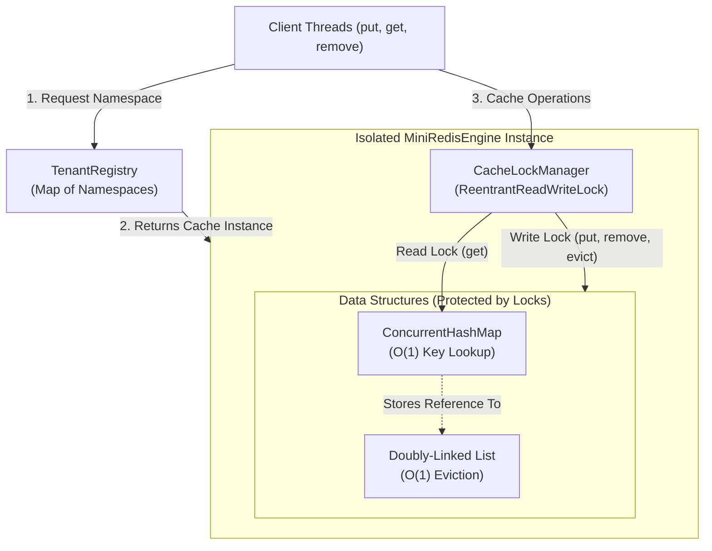

# Mini-Redis Cache Engine

A high-performance, in-memory caching engine built entirely from scratch in pure Java. No Spring, no Maven, zero external dependencies.

I built this to get hands-on experience with Java concurrency and memory management. It isolates data into different namespaces (multi-tenancy) within a single JVM, handles concurrent reads and writes safely, and enforces a strict **O(1) LRU eviction** policy so memory usage stays predictable.

---

## How it works — the big picture

At a high level, client threads request a specific cache "namespace" (like `user-sessions` or `products`) from the registry. The registry returns an isolated cache engine instance.


```mermaid
flowchart TB
    %% Client Interactions
    Clients["Client Threads (put, get, remove)"]

    %% Tenant Layer
    Registry["TenantRegistry\n(Map of Namespaces)"]

    %% Core Components
    subgraph Engine["Isolated MiniRedisEngine Instance"]
        direction TB
        LockManager["CacheLockManager\n(ReentrantReadWriteLock)"]
        
        subgraph DataStructures["Data Structures (Protected by Locks)"]
            direction LR
            NodeMap["ConcurrentHashMap\n(O(1) Key Lookup)"]
            LRUList["Doubly-Linked List\n(O(1) Eviction)"]
        end
    end
    
    %% Edges
    Clients -- "1. Request Namespace" --> Registry
    Registry -- "2. Returns Cache Instance" --> Engine
    
    Clients -- "3. Cache Operations" --> LockManager
    
    LockManager -- "Read Lock (get)" --> NodeMap
    LockManager -- "Write Lock (put, remove, evict)" --> DataStructures
    
    NodeMap -. "Stores Reference To" .-> LRUList
```

---

## The internals

### 1. Multi-Tenant Isolation
The `TenantRegistry` maps string identifiers (e.g., "user-service") to independent `MiniRedisEngine` instances. There is absolutely no shared mutable state between different namespaces, which prevents data leaks across tenants.

### 2. Concurrency & Locking
Instead of locking individual segments or the whole engine, I used a centralized `ReentrantReadWriteLock` with **fairness enabled** to prevent write starvation.
- **Read Path**: Multiple threads can acquire the read lock simultaneously for `get()` operations, maximizing throughput for read-heavy workloads.
- **Write Path**: Operations that mutate state (`put()`, `remove()`, or LRU reordering on a cache hit) acquire an exclusive write lock.

### 3. Achieving True O(1) LRU Eviction
The trickiest part was making eviction strictly $O(1)$. 
- The core storage is a standard Java `ConcurrentHashMap`. 
- However, instead of just storing the raw value, the map stores a direct reference to a `DoublyLinkedListNode`.
- A custom-built intrusive doubly-linked list tracks the access order.
- Because the `ConcurrentHashMap` gives us the exact memory reference to the node, unlinking and moving a node to the head (Most Recently Used) or evicting the tail (Least Recently Used) takes exactly $O(1)$ time via simple pointer manipulation, regardless of how huge the cache gets.

### 4. Lazy TTL Expiration
Keys expire lazily on access. If a thread tries to `get()` an expired key, it's purged right then and there. This naturally prevents memory leaks without needing the overhead of a background cleanup thread.

---

## Project structure

```text
src/main/java/com/cache/miniredis/
├── concurrency/
│   └── CacheLockManager.java      # Centralized read/write lock
├── core/
│   ├── TenantRegistry.java        # Multi-tenant namespace isolation
│   ├── CacheManager.java          # Core interface
│   └── MiniRedisEngine.java       # Primary cache implementation
├── eviction/
│   ├── DoublyLinkedListNode.java  # Node for LRU tracking
│   └── LRUEvictionStrategy.java   # O(1) list manipulation
├── MiniRedisApplication.java      # Entry point
└── TestEngine.java                # Multi-threaded test harness
```

---

## Building and Testing

Since I built this without Maven or Gradle to keep it pure, you can compile and run the comprehensive native test suite directly via the standard Java CLI.

**Step 1 — Compile:**
```bash
find src/main/java -name "*.java" | xargs javac -d out/
```

**Step 2 — Run the test suite:**
```bash
# Spawns 50 threads doing 10,000 operations each to stress test concurrency
java -cp out/ com.cache.miniredis.MiniRedisApplication
```

The output will prove that the LRU eviction works perfectly, namespaces don't leak, and the lock manager handles high concurrency without data corruption.
